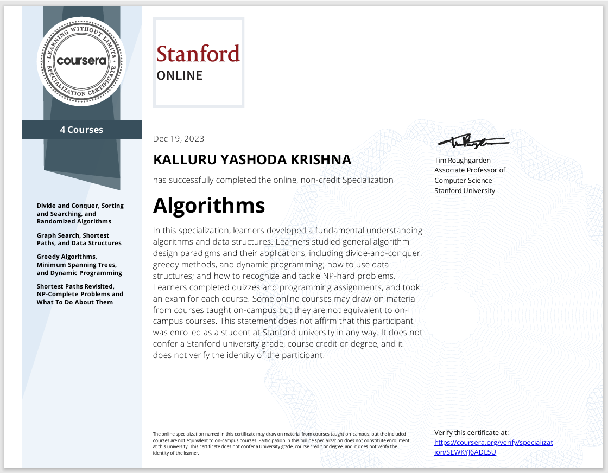
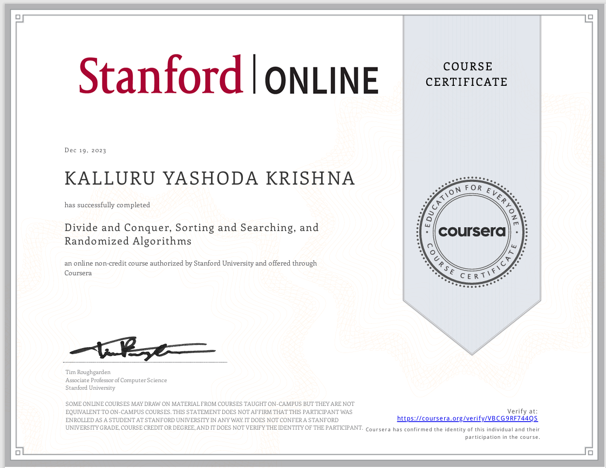
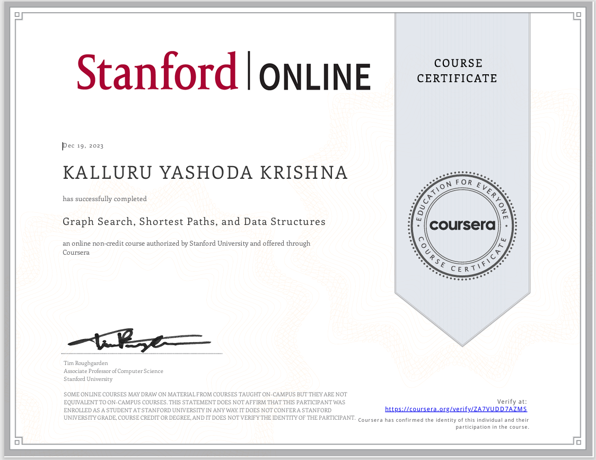
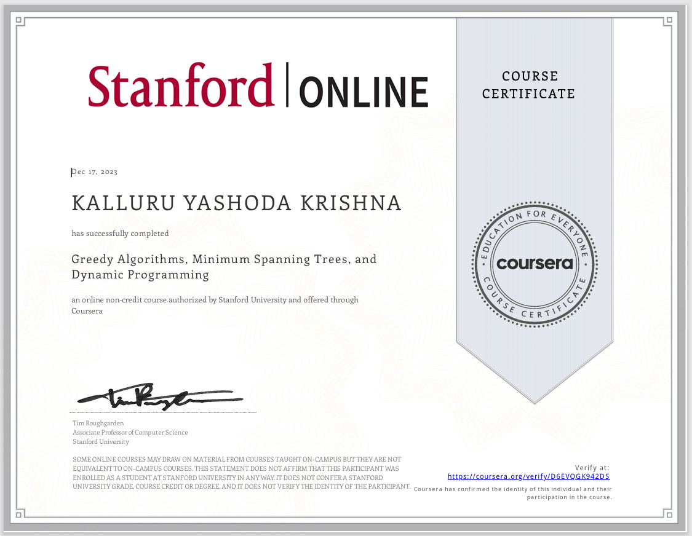
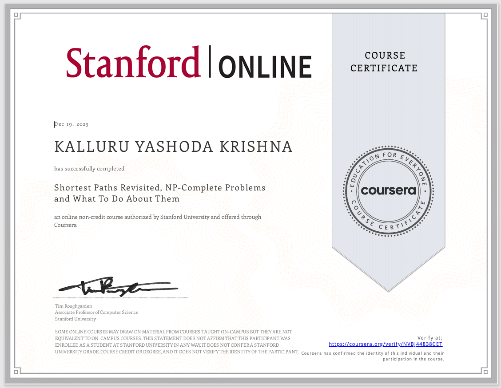

### Algorithms Specilization

### Divide and Conquer, Sorting and Searching, and Randmized Algorithms

### Graph Search, Shortest Paths, and Data Structures

### Greedy Algorithms, Minimum Spanning Trees, and Dynamic Programming

### Shortest Paths Revisited, NP-Complete Problems and What To Do About Them

